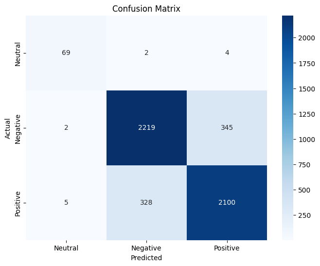
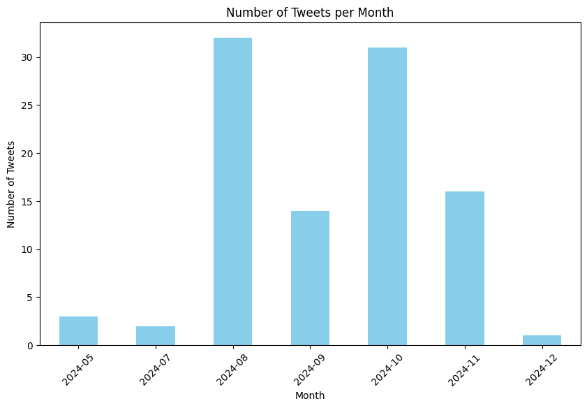
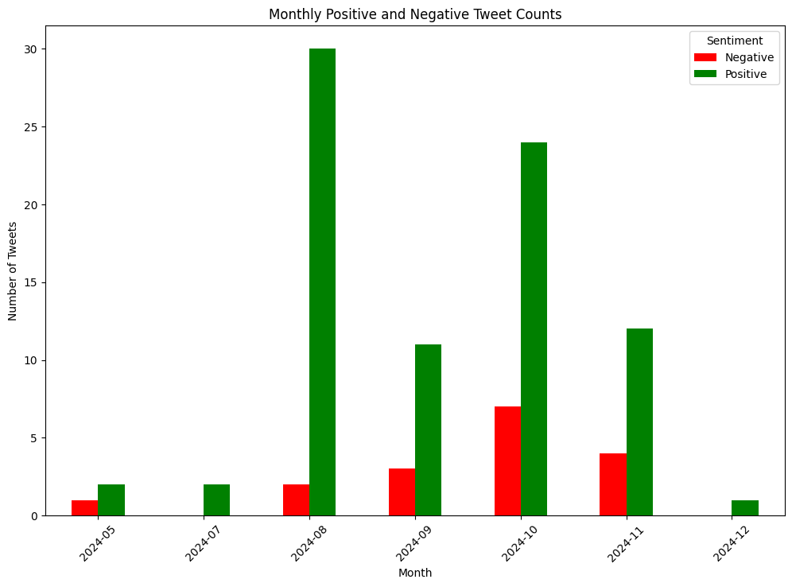

# Note: I'm stil working on it

# Sentiment Analysis using Machine Learning

This project uses machine learning algorithms to analyze text data and predict the sentiment (positive/negative) of a given sentence. The project involves text preprocessing, feature extraction, applying various classification models, and evaluating their performance.

## Objective
The goal of this project is to classify the sentiment of text data using Natural Language Processing (NLP) and machine learning techniques. Such analysis can be useful in various fields like social media monitoring, customer feedback analysis, and more.

The project processes text data and applies different classifiers to predict the sentiment of the sentences. Results are compared based on the accuracy of each model, allowing us to select the best-performing model.

## Features
- **Sentiment Analysis**: Classifies tweets as Positive or Negative based on a trained Logistic Regression model.
- **Monthly Tweet Analysis**: Extracts insights into the volume and sentiment of tweets over time.
- **Visualization**: Generates graphs for monthly tweet counts and sentiment trends.

## Libraries Used
The following Python libraries are used in this project:

- `numpy`: For mathematical computations.
- `pandas`: For data manipulation and analysis.
- `matplotlib`: For creating graphs and visualizations.
- `seaborn`: For advanced visualizations.
- `scikit-learn`: For implementing machine learning algorithms.
- `stopwordsiso`: Provides stopwords for sentiment analysis.
- `joblib`: For saving and loading models.
- `tqdm`: For displaying progress bars in loops.
- `xgboost`: Includes the XGBoost classification algorithm.
- `catboost`: Includes the CatBoost classification algorithm.

## Models and Accuracy Results
Several machine learning classifiers were trained and tested. Below are the accuracy scores for each model:

| Model                         | Accuracy (%) |
|-------------------------------|--------------|
| Logistic Regressor             | 86.58        |
| Random Forest Classifier       | 84.15        |
| Extra Trees Classifier         | 86.24        |
| AdaBoost Classifier            | 64.25        |
| Decision Tree Classifier       | 70.50        |
| K Neighbors Classifier         | 54.75        |
| CatBoost Classifier            | 84.86        |
| XGBoost Classifier             | 49.67        |


## Results
### Performance Evaluation
The model's performance was evaluated using a confusion matrix, which provides detailed insights into the classification accuracy across Neutral, Negative, and Positive sentiment classes.

- **Confusion Matrix**:
  Below is the confusion matrix showcasing the model's predictions compared to the actual labels:
  
  

- Key Observations:
  - **Neutral Tweets**: High accuracy with minimal misclassifications.
  - **Negative Tweets**: Most tweets are classified correctly, but there is some confusion with Positive tweets.
  - **Positive Tweets**: High accuracy, but a notable number of misclassifications as Negative.

### Visualizations
1. **Monthly Tweet Counts**:
   

2. **Monthly Sentiment Trends**:
   

## How to Run
1. Clone the repository:  
   `git clone https://github.com/haydarkadioglu/twitter-profile-analysis.git`
   
2. Install the required dependencies:  
   `pip install -r requirements.txt`

3. Prepare your dataset by placing it in the appropriate folder (`../dataset/tagged.csv`).

4. Run the script:  
   `python sentiment_analysis.py`

This will train the models and output the classification results along with the predicted sentiment for the sample input sentences.

## Conclusion
This project demonstrates how various machine learning models can be applied to sentiment analysis. By comparing the results, we can conclude which classifier performs best for this specific task. The top-performing models in terms of accuracy are Logistic Regression, Random Forest, and Extra Trees.

## Installation

To run the project, clone the repository and install the required libraries:

1. **Clone the Repository**
   ```bash
   git clone https://github.com/haydarkadioglu/sentence-analysis.git
   cd sentence-analysis
